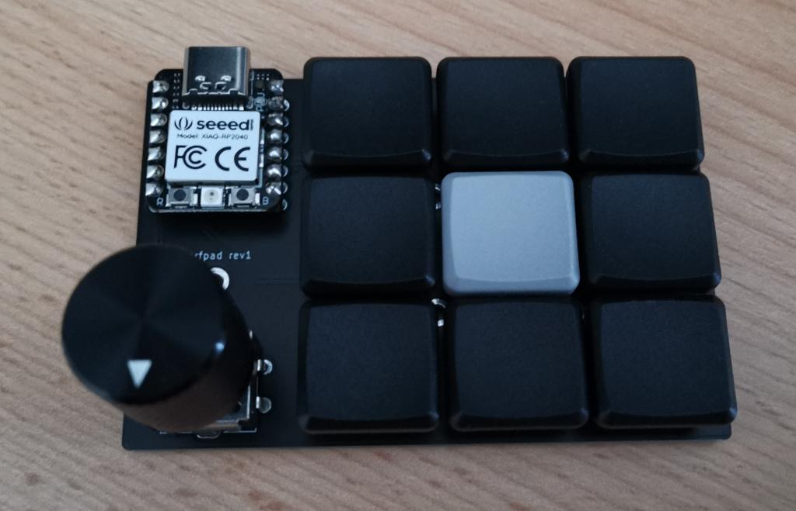

# narfpad

## BOM

- narfpad PCB
- 1 Seed Studio XIAO RP2040 (and sockets for it, optional but recommended)
- 10 SOD123 diodes
- 9 Kailh Choc Hotswap Sockets
- 9 Choc Switches (and keycaps)
- EC11 Encoder

## Hardware

The PCB has 5 mounting holes which allow for external mounting. Alternatively there is a `tilter.stl`
from which you can generate a tilted case which snugly fits the PCB.

## Firmware

Firmware available at https://github.com/sebastian-stumpf/qmk_firmware/tree/sepp/keyboards/narfpad
